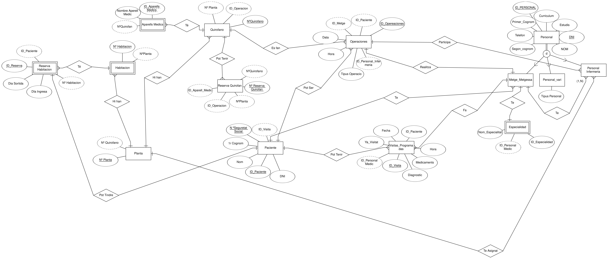

# PROJECTE PROGRAMACIÓ I BASE DE DADES

## Projecte Intermodular

### Contingut

## Esquema Relacional 

## Entitats i els seus atributs:

1. **Personal:** Hem creat aquesta entitat per poder tenir tot el personal d'una manera més recollida i eficient. Es definiran en tres relacions associatives: Metge_metgessa, Personal Infermeria, i personal vari (aquesta relació associativa contindrà un atribut de Tipus Personal).
   
   Atributs de Personal:
   - Id_personal (clau principal)
   - DNI (segona clau principal)
   - Nom
   - Primer_cognom
   - Segon_cognom
   - Telèfon
   - Estudis
   - Curriculum
   - Email

2. **Metge_metgessa:** Aquesta entitat guardarà la informació rellevant dels metges.
   
   Atributs de Metge_metgessa:
   - DNI (clau primària, associada a personal)
   - ID_Pacientm (clau forana referenciant a pacient)

3. **Especialtat:** Hem creat aquesta entitat per poder distingir a quina especialitat pertany cada metge.
   
   Atributs de Especialitat:
   - ID_especialitat (clau primària)
   - Nom_Especialitat
   - DNI (referència a Metge_Metgessa)

4. **Personal_Infermeria:** Hem creat aquesta entitat donat que és una de les principals de la nostra base de dades, juntament amb metges i pacients.
   
   Atributs de Personal_Infermeria:
   - DNI (clau primària)
   - DNI_Medic (clau forana que uneix infermeria amb metges)
   - Num_Planta (clau forana per unificar els infermers a la planta assignada)
   - ID_Operacions (clau forana per unificar els infermers assignats a les operacions)

5. **Personal_vari:** Aquesta entitat l'hem creat per poder distingir el personal que no siguin metges ni infermers.
   
   Atributs de Personal_vari:
   - DNI (clau primària)
   - Tipus_Personal (amb aquest atribut distingim el personal al qual pertoca)

6. **Pacient:** Aquesta entitat l'hem creat per poder guardar totes les dades dels pacients que visitin l'hospital.
   
   Atributs de Pacient:
   - ID_Pacient (clau principal)
   - Nº Seguretat Social (segona clau principal)
   - Nom
   - Primer_cognom
   - Segon_cognom
   - Telèfon
   - Data_Naixement
   - Sexe
   - ID_Visita (clau forana de l'entitat Visita)

7. **Visites Programades:** Hem creat aquesta entitat per programar les visites entre metges i pacients.
   
   Atributs de Visites Programades:
   - ID_Visita (clau principal)
   - Diagnostic (explicarà les conclusions a les quals ha arribat el metge)
   - Medicaments (quins medicaments s'han receptat, en cas de que s'hagin receptat)
   - Hora (de la visita)
   - Data (de la visita)
   - Ya_visitat (comprovarem si ja ha vingut a fer la visita)
   - ID_Personal_medic (clau forana de la relació metge)
   - ID_Pacient (clau forana de l'entitat Pacient)

8. **Reserva d'habitacions:** Aquesta entitat l'hem creat per poder portar al dia les reserves de les habitacions de l'hospital i saber quins pacients tenim ingressats, a quina habitació, el dia d'entrada i sortida.
   
   Atributs de Reserva d'habitacions:
   - ID_Reserva (clau principal)
   - Dia_ingrés
   - Dia_sortida
   - Nº Habitació (clau forana de l'entitat Habitació)
   - ID_Pacient (clau forana de l'entitat Pacient)

9. **Habitació:** Hem creat aquesta entitat per saber la quantitat d'habitacions que té l'hospital.
   
   Atributs d'Habitació:
   - Nº Habitació (clau primària)
   - Nº Planta (clau forana de l'entitat Planta)

10. **Planta:** Aquesta entitat l'hem creat per poder definir quantes plantes té l'hospital i quins quirofans té assignats a cada planta, juntament amb quin personal d'infermeria té associat.
   
    Atributs de Planta:
    - Nº Planta (clau principal)

11. **Quirofan:** Hem creat aquesta entitat on sabrem a quina planta està el quirofan al qual es faran les reserves.
   
    Atributs de Quirofan:
    - Num_Quirofano (clau principal)
    - Num_Planta (clau forana associada amb Planta)

12. **Reserva_Quirofan:** Aquesta entitat l'hem creat per als pacients que tenen previstes operacions i per poder saber els quirofans que queden lliures.
   
    Atributs de Reserva_Quirofan:
    - Num_reserva_Quirofan (clau principal)
    - Num_Quirofano (clau forana referenciant Quirofan)

13. **Aparells_Medics:** Hem creat aquesta entitat donat que s'han d'assignar diferents equips medics als diferents quirofans.
   
    Atributs de Aparells_Medics:
    - ID_Aparells_Medics (clau primària)
    - Nom_Aperell_Medic
    - Num_Quirofano (clau forana que uneix amb Quirofan)

14. **Operaciones:** Aquesta entitat ha sigut creada per saber quin pacient s'ha d'operar, quin dia i hora, juntament amb el metge que l'operarà i a quin quirofen.

   Atributs de Operaciones:
   - ID_Operaciones (clau primària)
   - Dia_Operacio
   - Hora_Operacio
   - Tipus_Operacio (l'operació que s'ha de fer)
   - ID_Paciente (clau forana per saber quin pacient s'ha d'operar)
   - Num_Quirofano (clau forana per saber a quin quirofà s'opera)
   - DNI_metge (clau forana per saber quin és el metge que ha d'operar)

