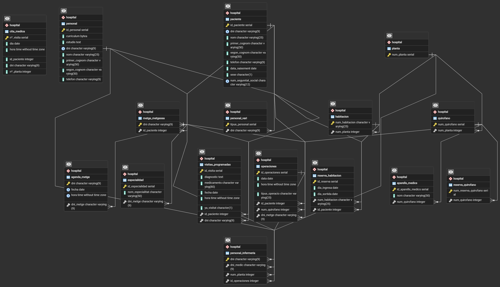

# PROJECTE PROGRAMACIO Y BASE DE DADES

## Projecte Intermodular

### Contenido

## Esquema Relacional 

## Entitats i els seus atributs:
1- Personal: Hem creat aquesta entitat per poder tenir tot el personal d'una manera mes recollida i eficient,es definiran en tres relacions asociatives:
Metge_metgessa, Personal Infermeria i personal vari(aquesta relacio asociativa contindra un atribut de Tipus Personal).

Dins de personal tenim els seguents atributs:
    1.1 Id_personal, Sera la clau principal.
    1.2 DNI, Una segona clau principal.
    1.3 Nom
    1.4 Primer_cognom
    1.5 Segon_cognom
    1.6 Telefon
    1.7 Estudis
    1.8 Curriculum

2- Paciente: Aquesta entitat l'hem creat per poder guardar totes les dades dels pacients que visitin l'hospital.

Dins de Paciente trobarem els atributs:
    2.1 ID_Paciente, Sera la clau principal.
    2.2 Nº Seguretat Social, Una segona clau principal.
    2.3 Nom
    2.4 Primer_cognom
    2.5 Segon_cognom
    2.6 Telefon
    2.7 Data_Naixament
    2.8 Sexe
    2.9 ID_Visita, clau forana de l'entitat Visita.

3- Visites Programades: Hem creat aquesta entitat per programar les visites entre metges i pacients.

Dins de Visites Programades trobarem els atributs:
    3.1 ID_Visita, sera la clau principal.
    3.2 Diagnostic, Explicara les conclusions a les que ha arrivat el metge
    3.3 Medicaments, Quins medicaments s'han recceptat (en cas de que es recceptin)
    3.4 Hora (De la visita)
    3.5 Data (De la visita)
    3.6 Ya_visitat, comprovarem si ya ha vingut a fer la visita
    3.7 ID_Personal medic, clau forana de la relacio metge.
    3.8 ID_Pacient, clau forana de la l'entitat Pacient.

4- Reserva d'habitacions: Aquesta entitat l'hem creat per poder portar al dia les reserves de les habitacions de l'hospital i sebre quins pacients tenim ingressats, a quina habitacio, el dia d'entrada i sortida.

Dins de Reserva d'habitacions trobarem els atributs:
    4.1 ID_Reserva, seria la clau principal.
    4.2 Dia ingres.
    4.3 Dia sortida.
    4.4 Nº Habitacio, clau forana de l'entitat Habitacio
    4.5 ID_Pacient, clau forana de l'entitat Pacient

5- Habitacio: Hem creat aquesta entitat per sebre la cuantitat d'habitacions que te l'hospital.

Dins d'Habitacio trobarem els atributs:
    5.1 Nº Habitacio, sera la clau primaria.
    5.2 Nº Planta, Clau forana de l'entitat planta

6 Planta: Aquesta entitat l'hem creat per poder definir cuantes plantes te l'hospital i quins quirofans te asignat a cada planta.

Dins de Planta trobarem els atributs:
    6.1 Nº Planta, seria la clau principal
    6.2 